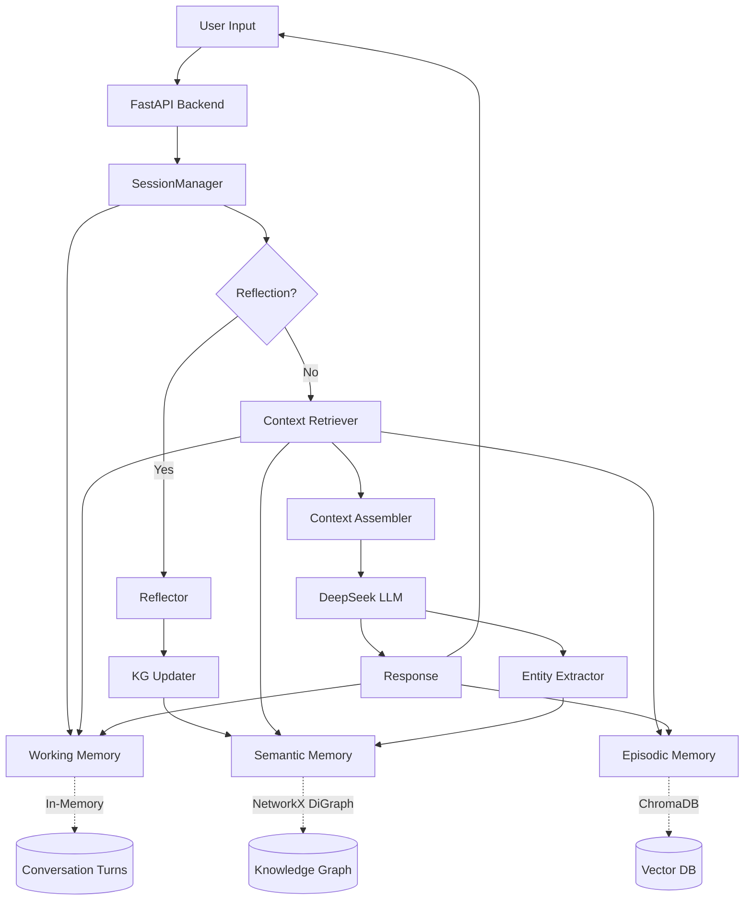

# MemoAgent

A production-grade AI agent framework with persistent memory and reflection learning capabilities. MemoAgent implements a three-tier memory architecture (semantic, episodic, working) and learns continuously from user corrections through automated reflection mechanisms.

## Overview

Modern large language models excel at in-context learning but lack persistent memory across sessions. MemoAgent addresses this limitation by providing:

- **Persistent Semantic Memory**: Knowledge graph storing entities, relations, and validated guidelines extracted through reflection
- **Episodic Memory**: Vector database indexing historical conversations for context retrieval
- **Working Memory**: Session-scoped conversation buffer with intelligent context assembly
- **Reflection Learning**: Automated extraction of reasoning rules from user corrections, enabling continuous improvement

## Features

### Core Capabilities

- **Multi-tier Memory System**
  - Semantic memory backed by a NetworkX directed graph
  - Episodic memory using ChromaDB with sentence-transformer embeddings
  - Working memory with configurable token budget allocation
  - Mixed retrieval combining KG subgraph traversal and vector similarity

- **Reflection Learning**
  - Detects user corrections via keyword matching and explicit commands
  - Extracts generalizable guidelines using LLM-based reflection
  - Validates guidelines for duplication before updating the knowledge graph
  - Maintains an audit trail in structured JSONL logs

- **Production-Ready Backend**
  - FastAPI with WebSocket streaming support
  - LLM retry mechanism with exponential backoff (1s → 2s → 4s)
  - Entity extraction caching using MD5 hashing
  - Token budget management (semantic: 1000 tokens, episodic: 1500 tokens, total: 80% of context window)
  - CORS, security headers, and health check endpoints

- **Modern Web Interface**
  - React 18 + TypeScript + Vite frontend
  - Auto-reconnecting WebSocket with exponential backoff
  - Real-time streaming response rendering
  - Memory status dashboard and knowledge graph visualization

### System Architecture



### Memory System Details

**Semantic Memory (Knowledge Graph)**
- Nodes: entities (concepts, models, tasks) and guidelines (reflection-derived rules)
- Edges: typed relations (`variant_of`, `uses`, `governs`, etc.)
- Subgraph retrieval: BFS traversal from query entities up to a configurable depth
- Storage: JSON serialization via NetworkX

**Episodic Memory (Vector Database)**
- Collection: ChromaDB with `all-MiniLM-L6-v2` embeddings (384 dimensions)
- Documents: `{timestamp} User: {query}\nAssistant: {response}` format
- Retrieval: cosine similarity, top-k with a configurable threshold
- Metadata: timestamp and conversation_id for filtering

**Working Memory**
- FIFO buffer of recent conversation turns (default: 50 turns max)
- Tracks role (user/assistant) and message content
- Cleared on session start or explicit reset

## Quick Start

### Prerequisites

- Python 3.11+
- Node.js 18+ (for frontend)
- Docker & Docker Compose (optional, for containerized deployment)

### Environment Setup

1. Clone the repository:
```bash
git clone https://github.com/shijezhang/memoAgent.git
cd memoAgent
```

2. Create a `.env` file in the project root:
```bash
DEEPSEEK_API_KEY=your-api-key-here
```

### Option 1: Docker Deployment (Recommended)

```bash
docker-compose up -d
```

Access the application:
- Frontend: http://localhost
- Backend API: http://localhost/api
- API Docs: http://localhost/api/docs

### Option 2: Local Development

**Backend:**
```bash
# Install dependencies
pip install -e .

# Run server
python -m memo_agent.api.app
# Or with uvicorn
uvicorn memo_agent.api.app:app --host 0.0.0.0 --port 8000
```

**Frontend:**
```bash
cd frontend
npm install
npm run dev
```

Access the application:
- Frontend: http://localhost:3000
- Backend API: http://localhost:8000
- API Docs: http://localhost:8000/docs

## Configuration

Configuration is managed via `src/memo_agent/config.py` and environment variables.

### Key Settings

| Parameter | Default | Description |
|-----------|---------|-------------|
| `llm_provider` | `deepseek` | LLM provider identifier |
| `llm_model` | `deepseek-chat` | Model name |
| `llm_base_url` | `https://api.deepseek.com` | API endpoint |
| `embedding_model` | `all-MiniLM-L6-v2` | Sentence transformer model |
| `max_context_tokens` | `64000` | Total context window limit |
| `context_usage_ratio` | `0.8` | Proportion of context allocated to memory |
| `subgraph_max_tokens` | `1000` | Token budget for semantic memory |
| `episodic_max_tokens` | `1500` | Token budget for episodic memory |
| `episodic_top_k` | `3` | Number of similar conversations to retrieve |
| `reflection_recent_turns` | `3` | Conversation history used for reflection |
| `llm_max_retries` | `3` | Max retry attempts on LLM failure |
| `llm_retry_base_delay` | `1.0` | Base delay in seconds (exponential backoff) |
| `working_memory_max_turns` | `50` | Max turns in working memory buffer |
| `negation_keywords` | `["不对", "错了", ...]` | Keywords that trigger reflection detection |

### Token Budget Allocation

The system allocates context window capacity as follows:

```python
available_tokens = max_context_tokens * context_usage_ratio  # 64000 * 0.8 = 51200
guideline_tokens = min(guideline_actual, available - subgraph_max - episodic_max)
subgraph_tokens = min(subgraph_actual, subgraph_max_tokens)  # max 1000
episodic_tokens = min(episodic_actual, episodic_max_tokens)  # max 1500
working_tokens = available - (guideline_tokens + subgraph_tokens + episodic_tokens)
```

## API Reference

### Chat Endpoints

**POST /api/chat**
```json
{
  "message": "What is the Transformer architecture?",
  "session_id": "optional-session-id"
}
```

Response:
```json
{
  "response": "Transformer is a sequence model architecture...",
  "session_id": "generated-or-provided-session-id",
  "entities": ["Transformer", "Self-Attention"],
  "guidelines_used": ["Rule about Transformers..."],
  "is_reflection": false,
  "guideline": null
}
```

**WebSocket /api/chat/ws**
- Accepts text messages (user queries)
- Streams the response back
- Sends a `[DONE]` marker after completion

### Memory Management

**GET /api/memory/status**
```json
{
  "semantic": {
    "entities": 42,
    "guidelines": 15
  },
  "episodic": {
    "conversations": 128
  },
  "working": {
    "turns": 8
  }
}
```

**DELETE /api/memory/episodic**
Clears all episodic memory (vector database). Returns `{"status": "ok"}`.

### Knowledge Graph

**GET /api/knowledge/graph**
Returns the complete knowledge graph structure:
```json
{
  "nodes": [
    {"id": "node_id", "type": "entity", "name": "BERT", "rule": null}
  ],
  "edges": [
    {"source": "node_a", "target": "node_b", "relation": "variant_of"}
  ]
}
```

**GET /api/knowledge/subgraph?entity=BERT**
Returns the subgraph centered on the specified entity (depth = 1 traversal).

**POST /api/knowledge/entity**
```json
{
  "name": "New Entity Name"
}
```

**DELETE /api/knowledge/entity/{entity_id}**
Removes an entity and its edges from the knowledge graph.

### Reflection & Guidelines

**GET /api/reflections?limit=50&entity=BERT**
Returns reflection log entries (most recent first).

**GET /api/guidelines**
Returns all guidelines (rule-type nodes) in the knowledge graph.

## Development

### Code Quality

```bash
# Linting
ruff check src/

# Type checking
mypy src/

# Run tests
pytest tests/
```

### Frontend Development

```bash
cd frontend

# Linting
npm run lint

# Type checking
tsc --noEmit

# Format code
npm run format

# Build for production
npm run build
```

### CI/CD Pipeline

A GitHub Actions workflow runs on every push:
- Backend: pytest, ruff lint, mypy type checking
- Frontend: lint, TypeScript build verification

See `.github/workflows/ci.yml` for details.

## Experiments & Results

The project includes three controlled experiments evaluating memory system performance. Full details in [docs/EXPERIMENT_REPORT.md](docs/EXPERIMENT_REPORT.md).

### Experiment 1: Guideline Retrieval Accuracy

**Setup**: 15 pre-seeded guidelines, 20 questions requiring guideline application

| Metric | Result |
|--------|--------|
| Questions answered | 20/20 |
| Guidelines matched | 15/15 (100%) |
| Avg. guidelines per response | 2.15 |
| False positive rate | 0% |

**Key finding**: Semantic memory retrieves relevant guidelines with zero false positives when entities are correctly extracted from the query.

### Experiment 2: Reflection Learning

**Setup**: 10 correction scenarios, each providing user feedback on an incorrect response

| Metric | Result |
|--------|--------|
| Corrections provided | 10/10 |
| Guidelines extracted | 10/10 (100%) |
| Duplicate prevention | 10/10 (100%) |
| Guidelines reused in retests | 9/10 (90%) |

**Key finding**: The reflection mechanism reliably extracts actionable guidelines from corrections. The one miss in retests traced back to an entity extraction failure, not a reflection failure.

### Experiment 3: Episodic Memory Retrieval

**Setup**: 30 conversations stored, 15 test queries requiring historical context

| Metric | Result |
|--------|--------|
| Queries executed | 15/15 |
| Relevant conversations retrieved | 12/15 (80%) |
| Avg. similarity score | 0.71 |
| False retrievals | 2/15 (13%) |

**Key finding**: Vector-based episodic retrieval achieves 80% recall with a 13% false-positive rate. Performance degrades on queries with terminology mismatch (e.g. synonym usage).

### Observations

- **Strengths**: Guidelines provide deterministic, high-precision memory. Reflection converges to a stable rule set after 5-10 corrections.
- **Limitations**: Episodic retrieval is sensitive to embedding quality; entity extraction requires careful prompt engineering.
- **Future work**: hybrid retrieval combining dense and sparse methods, multi-hop reasoning over the knowledge graph, guideline pruning strategies.

## Project Structure

```
memoAgent/
├── src/memo_agent/          # Main package
│   ├── api/                 # FastAPI backend
│   │   ├── routes/          # API endpoints
│   │   ├── schemas.py       # Pydantic models
│   │   └── app.py           # Application factory
│   ├── memory/              # Memory implementations
│   │   ├── semantic.py      # Knowledge graph
│   │   ├── episodic.py      # Vector database
│   │   └── working.py       # Session buffer
│   ├── core/                # Core orchestration
│   ├── reflection/          # Reflection learning
│   │   ├── reflector.py     # Guideline extraction
│   │   └── kg_updater.py    # Knowledge graph updates
│   ├── utils/                # Utilities (LLM retry, token counting)
│   ├── models.py             # Data models
│   └── config.py             # Configuration
├── frontend/                 # React frontend
│   ├── src/
│   │   ├── components/       # UI components
│   │   ├── hooks/            # Custom hooks (e.g. useWebSocket)
│   │   ├── store/             # Zustand state management
│   │   └── pages/             # Route pages
│   └── package.json
├── experiments/              # Evaluation scripts
│   ├── run_experiment1.py
│   ├── run_experiment2.py
│   └── run_experiment3.py
├── docs/                      # Documentation
│   ├── EXPERIMENT_REPORT.md
│   └── EXPERIMENT_DESIGN.md
├── docker-compose.yml         # Multi-container setup
├── Dockerfile.backend         # Backend container
├── Dockerfile.frontend        # Frontend container
├── nginx.conf                 # Reverse proxy config
├── pyproject.toml             # Python dependencies
└── README.md
```

## License

MIT License - see [LICENSE](LICENSE) for details.

## Author

张世杰 (Zhang Shijie) - [GitHub](https://github.com/shijezhang)

## Contributing

Contributions are welcome:

1. Fork the repository
2. Create a feature branch (`git checkout -b feature/your-feature`)
3. Ensure tests and linting pass (`ruff check`, `mypy`, `pytest`)
4. Commit with descriptive messages
5. Push to your fork and open a pull request

## Acknowledgments

- Built with [LangChain](https://github.com/langchain-ai/langchain) for LLM orchestration
- Powered by [DeepSeek](https://www.deepseek.com/) language models
- Embeddings via [sentence-transformers](https://www.sbert.net/)
- Vector storage using [ChromaDB](https://www.trychroma.com/)
