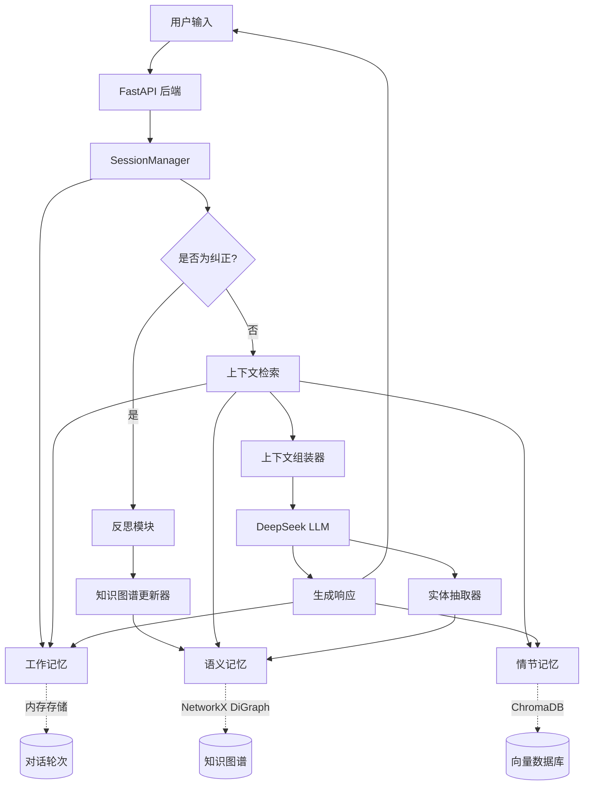

# MemoAgent

一个具备持久化记忆和反思学习能力的生产级 AI Agent 框架。MemoAgent 实现了三层记忆架构（语义记忆、情节记忆、工作记忆），并通过自动化的反思学习机制，从用户纠正中持续学习和改进。

## 项目概述

当前的大语言模型在上下文学习（in-context learning）方面表现优异，但跨会话的持久化记忆能力普遍缺失。MemoAgent 针对这一局限提供了如下能力：

- **持久化语义记忆**：以知识图谱形式存储实体、关系以及通过反思沉淀下来的规则（Guideline）
- **情节记忆**：基于向量数据库索引历史对话，支持相关上下文检索
- **工作记忆**：会话级的对话缓冲区，并配合智能的上下文组装策略
- **反思学习**：从用户纠正中自动提取可泛化的推理规则，实现持续改进

## 核心特性

### 基础能力

- **多级记忆系统**
  - 语义记忆基于 NetworkX 有向图
  - 情节记忆基于 ChromaDB 向量数据库，使用 sentence-transformer 嵌入
  - 工作记忆支持可配置的 token 预算分配
  - 混合检索：结合知识图谱子图遍历与向量相似度检索

- **反思学习**
  - 通过关键词匹配和显式命令识别用户纠正
  - 使用 LLM 从纠正内容中提取可泛化的规则
  - 在写入知识图谱前进行去重校验
  - 以结构化 JSONL 格式维护完整的审计日志

- **生产级后端**
  - 基于 FastAPI，支持 WebSocket 流式响应
  - LLM 调用带指数退避重试机制（1s → 2s → 4s）
  - 实体抽取结果基于 MD5 缓存，减少重复调用
  - Token 预算管理（语义记忆：1000 tokens，情节记忆：1500 tokens，总预算为上下文窗口的 80%）
  - 内置 CORS、安全响应头与健康检查接口

- **现代化前端**
  - React 18 + TypeScript + Vite
  - WebSocket 断线自动重连（指数退避）
  - 实时流式响应渲染
  - 记忆状态看板与知识图谱可视化

### 系统架构



### 记忆系统细节

**语义记忆（知识图谱）**
- 节点：实体（概念、模型、任务）与规则（反思沉淀的 Guideline）
- 边：带类型的关系（`variant_of`、`uses`、`governs` 等）
- 子图检索：从查询实体出发进行 BFS 遍历，深度可配置
- 存储方式：通过 NetworkX 序列化为 JSON

**情节记忆（向量数据库）**
- 集合：ChromaDB，使用 `all-MiniLM-L6-v2` 嵌入模型（384 维）
- 文档格式：`{timestamp} User: {query}\nAssistant: {response}`
- 检索方式：余弦相似度，Top-K 检索（K 可配置）
- 元数据：时间戳、conversation_id，用于过滤

**工作记忆**
- FIFO 缓冲区，保存最近的对话轮次（默认最多 50 轮）
- 记录角色（user/assistant）与消息内容
- 会话开始或显式重置时清空

## 快速开始

### 环境要求

- Python 3.11+
- Node.js 18+（前端）
- Docker & Docker Compose（可选，用于容器化部署）

### 环境配置

1. 克隆仓库：
```bash
git clone https://github.com/shijezhang/memoAgent.git
cd memoAgent
```

2. 在项目根目录创建 `.env` 文件：
```bash
DEEPSEEK_API_KEY=your-api-key-here
```

### 方式一：Docker 部署（推荐）

```bash
docker-compose up -d
```

访问地址：
- 前端：http://localhost
- 后端 API：http://localhost/api
- API 文档：http://localhost/api/docs

### 方式二：本地开发

**后端：**
```bash
# 安装依赖
pip install -e .

# 启动服务
python -m memo_agent.api.app
# 或使用 uvicorn
uvicorn memo_agent.api.app:app --host 0.0.0.0 --port 8000
```

**前端：**
```bash
cd frontend
npm install
npm run dev
```

访问地址：
- 前端：http://localhost:3000
- 后端 API：http://localhost:8000
- API 文档：http://localhost:8000/docs

## 配置说明

配置项由 `src/memo_agent/config.py` 及环境变量统一管理。

### 关键配置项

| 参数 | 默认值 | 说明 |
|-----------|---------|-------------|
| `llm_provider` | `deepseek` | LLM 提供商标识 |
| `llm_model` | `deepseek-chat` | 模型名称 |
| `llm_base_url` | `https://api.deepseek.com` | API 地址 |
| `embedding_model` | `all-MiniLM-L6-v2` | 句向量嵌入模型 |
| `max_context_tokens` | `64000` | 上下文窗口总长度 |
| `context_usage_ratio` | `0.8` | 分配给记忆内容的上下文比例 |
| `subgraph_max_tokens` | `1000` | 语义记忆 token 预算 |
| `episodic_max_tokens` | `1500` | 情节记忆 token 预算 |
| `episodic_top_k` | `3` | 情节记忆检索返回的相似对话数量 |
| `reflection_recent_turns` | `3` | 反思时回溯的历史轮次数 |
| `llm_max_retries` | `3` | LLM 调用失败时的最大重试次数 |
| `llm_retry_base_delay` | `1.0` | 重试基础延迟（秒），采用指数退避 |
| `working_memory_max_turns` | `50` | 工作记忆缓冲区最大轮次 |
| `negation_keywords` | `["不对", "错了", ...]` | 触发反思检测的关键词 |

### Token 预算分配

系统按如下方式分配上下文窗口容量：

```python
available_tokens = max_context_tokens * context_usage_ratio  # 64000 * 0.8 = 51200
guideline_tokens = min(guideline_actual, available - subgraph_max - episodic_max)
subgraph_tokens = min(subgraph_actual, subgraph_max_tokens)  # 上限 1000
episodic_tokens = min(episodic_actual, episodic_max_tokens)  # 上限 1500
working_tokens = available - (guideline_tokens + subgraph_tokens + episodic_tokens)
```

## API 参考

### 对话接口

**POST /api/chat**
```json
{
  "message": "什么是 Transformer 架构？",
  "session_id": "可选的会话 ID"
}
```

响应：
```json
{
  "response": "Transformer 是一种基于自注意力机制的序列模型架构...",
  "session_id": "自动生成或传入的会话 ID",
  "entities": ["Transformer", "Self-Attention"],
  "guidelines_used": ["与 Transformer 相关的规则..."],
  "is_reflection": false,
  "guideline": null
}
```

**WebSocket /api/chat/ws**
- 接收文本消息（用户提问）
- 流式返回响应内容
- 响应完成后发送 `[DONE]` 标记

### 记忆管理

**GET /api/memory/status**
```json
{
  "semantic": {
    "entities": 42,
    "guidelines": 15
  },
  "episodic": {
    "conversations": 128
  },
  "working": {
    "turns": 8
  }
}
```

**DELETE /api/memory/episodic**
清空全部情节记忆（向量数据库）。返回 `{"status": "ok"}`。

### 知识图谱

**GET /api/knowledge/graph**
返回完整的知识图谱结构：
```json
{
  "nodes": [
    {"id": "node_id", "type": "entity", "name": "BERT", "rule": null}
  ],
  "edges": [
    {"source": "node_a", "target": "node_b", "relation": "variant_of"}
  ]
}
```

**GET /api/knowledge/subgraph?entity=BERT**
返回以指定实体为中心的子图（深度为 1 的遍历）。

**POST /api/knowledge/entity**
```json
{
  "name": "新实体名称"
}
```

**DELETE /api/knowledge/entity/{entity_id}**
删除指定实体及其关联的边。

### 反思与规则

**GET /api/reflections?limit=50&entity=BERT**
返回反思日志记录（按时间倒序）。

**GET /api/guidelines**
返回知识图谱中所有的规则（rule 类型节点）。

## 开发指南

### 代码质量

```bash
# 代码检查
ruff check src/

# 类型检查
mypy src/

# 运行测试
pytest tests/
```

### 前端开发

```bash
cd frontend

# 代码检查
npm run lint

# 类型检查
tsc --noEmit

# 代码格式化
npm run format

# 生产构建
npm run build
```

### CI/CD 流程

GitHub Actions 会在每次推送时自动运行：
- 后端：pytest 测试、ruff 代码检查、mypy 类型检查
- 前端：ESLint 检查、TypeScript 构建验证

详见 `.github/workflows/ci.yml`。

## 实验与结果

项目包含三个评估记忆系统性能的对照实验。完整细节见 [docs/EXPERIMENT_REPORT.md](docs/EXPERIMENT_REPORT.md)。

### 实验一：规则检索准确性

**设置**：预置 15 条规则，20 个需要应用规则回答的问题

| 指标 | 结果 |
|--------|--------|
| 完成回答数 | 20/20 |
| 规则匹配成功数 | 15/15（100%） |
| 平均每次响应引用规则数 | 2.15 |
| 误检率 | 0% |

**核心发现**：当实体抽取准确时，语义记忆能够以零误检率检索到相关规则。

### 实验二：反思学习效果

**设置**：10 个纠正场景，每个场景针对一次错误回答提供用户纠正

| 指标 | 结果 |
|--------|--------|
| 完成纠正数 | 10/10 |
| 规则提取成功数 | 10/10（100%） |
| 去重校验成功数 | 10/10（100%） |
| 复测中规则命中数 | 9/10（90%） |

**核心发现**：反思机制能够稳定地从纠正内容中提取可执行规则。复测中唯一的未命中案例，问题出在实体抽取环节，而非反思本身。

### 实验三：情节记忆检索

**设置**：存储 30 段对话，15 个需要历史上下文的测试查询

| 指标 | 结果 |
|--------|--------|
| 完成查询数 | 15/15 |
| 相关对话检索成功数 | 12/15（80%） |
| 平均相似度得分 | 0.71 |
| 误检数 | 2/15（13%） |

**核心发现**：基于向量的情节记忆检索召回率达到 80%，误检率为 13%。在存在术语不一致（如同义词表达）的查询上表现有所下降。

### 观察与结论

- **优势**：规则型记忆提供了确定性、高精度的检索能力。反思机制在 5-10 次纠正后趋于收敛，形成稳定的规则集。
- **局限**：情节记忆检索对嵌入质量较为敏感；实体抽取依赖精心设计的 Prompt。
- **未来方向**：结合稠密与稀疏检索的混合方案、知识图谱上的多跳推理、规则剪枝策略。

## 项目结构

```
memoAgent/
├── src/memo_agent/          # 主程序包
│   ├── api/                 # FastAPI 后端
│   │   ├── routes/          # API 路由
│   │   ├── schemas.py       # Pydantic 数据模型
│   │   └── app.py           # 应用工厂
│   ├── memory/              # 记忆系统实现
│   │   ├── semantic.py      # 知识图谱
│   │   ├── episodic.py      # 向量数据库
│   │   └── working.py       # 会话缓冲区
│   ├── core/                # 核心编排逻辑
│   ├── reflection/          # 反思学习
│   │   ├── reflector.py     # 规则提取
│   │   └── kg_updater.py    # 知识图谱更新
│   ├── utils/                # 工具模块（LLM 重试、token 计数）
│   ├── models.py             # 数据模型
│   └── config.py             # 配置管理
├── frontend/                 # React 前端
│   ├── src/
│   │   ├── components/       # UI 组件
│   │   ├── hooks/            # 自定义 hooks（如 useWebSocket）
│   │   ├── store/             # Zustand 状态管理
│   │   └── pages/             # 路由页面
│   └── package.json
├── experiments/               # 评估脚本
│   ├── run_experiment1.py
│   ├── run_experiment2.py
│   └── run_experiment3.py
├── docs/                      # 文档
│   ├── EXPERIMENT_REPORT.md
│   └── EXPERIMENT_DESIGN.md
├── docker-compose.yml         # 多容器编排配置
├── Dockerfile.backend         # 后端容器
├── Dockerfile.frontend        # 前端容器
├── nginx.conf                 # 反向代理配置
├── pyproject.toml             # Python 依赖管理
└── README.md
```

## 许可证

MIT License，详见 [LICENSE](LICENSE)。

## 作者

张世杰 (Zhang Shijie) - [GitHub](https://github.com/shijezhang)

## 贡献指南

欢迎参与贡献：

1. Fork 本仓库
2. 创建功能分支（`git checkout -b feature/your-feature`）
3. 确保测试与代码检查通过（`ruff check`、`mypy`、`pytest`）
4. 提交清晰的变更说明
5. Push 到你的 Fork 并提交 Pull Request

## 致谢

- 基于 [LangChain](https://github.com/langchain-ai/langchain) 进行 LLM 编排
- 由 [DeepSeek](https://www.deepseek.com/) 语言模型提供支持
- 嵌入模型来自 [sentence-transformers](https://www.sbert.net/)
- 向量存储使用 [ChromaDB](https://www.trychroma.com/)
